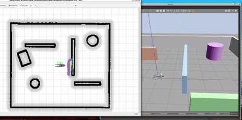

# Unitree Go2 + Livox MID-360 + FAST-LIO + Nav2

本项目在 Ubuntu 22.04、ROS 2 Humble 和 Gazebo Classic 11 中仿真 Unitree Go2 与 Livox MID-360，并提供一套已经建好的地图。完成安装后，可以直接启动 Gazebo 和 RViz，进行三维点云定位与 Nav2 目标点导航，不需要先自行建图。

## 演示视频



上图展示了项目在 Gazebo 和 RViz 中的实际运行效果，包括已有地图定位和 Nav2 目标点导航。

## 一、普通部署与使用

### 1. 环境要求

- Ubuntu 22.04（原生 Ubuntu 或 WSL2 均可）
- ROS 2 Humble Desktop
- 能正常显示 Gazebo 和 RViz 图形窗口
- 安装过程需要网络和 `sudo` 权限

### 2. 下载并自动安装

打开 Ubuntu 终端，依次执行：

```bash
sudo apt update
sudo apt install -y git

mkdir -p ~/go2_ws/src
cd ~/go2_ws/src
git clone https://github.com/icecream127/go2-mid360-fastlio-nav2.git unitree-go2-ros2

cd unitree-go2-ros2
./tools/setup_mid360_dependencies.bash
```

安装脚本会自动完成以下工作：

- 安装项目需要的 ROS 2 和系统依赖；
- 下载固定版本的 Livox SDK2、Livox ROS 2 驱动、Livox Gazebo 插件和 FAST-LIO；
- 应用 ROS 2 Humble 兼容补丁；
- 编译整个 `~/go2_ws` 工作空间；
- 把仓库附带的地图复制到 `~/go2_ws/maps`。

终端出现下面这行就表示安装和编译完成：

```text
Dependencies and workspace build completed.
```

首次安装需要下载和编译多个项目，耗时取决于网络和电脑性能。如果网络临时中断，可重新运行同一个安装命令。

### 3. 一条命令启动

```bash
cd ~/go2_ws
source /opt/ros/humble/setup.bash
source install/setup.bash
ros2 launch go2_nav_bringup navigation.launch.py gui:=true show_rviz:=true
```

等待 Gazebo 和 RViz 窗口出现；系统会先让机器狗站稳，再初始化 FAST-LIO。也可以继续使用 `./src/unitree-go2-ros2/tools/run_fast_lio_nav2_demo.bash`，它会自动加载上述环境并调用同一个启动文件。

如果已有其他 Gazebo 或同类 ROS 2 仿真正在运行，请先将其关闭，避免端口、节点名和话题冲突。

启动脚本默认使用 Fast DDS 共享内存传输，以免高流量点云影响 Nav2 生命周期服务。如果所在环境不支持共享内存，可在启动命令前设置 `GO2_DDS_TRANSPORT=udp` 切换为 UDP。

### 4. 在 RViz 中导航

1. 确认 Gazebo 中已经出现机器狗；
2. 等待终端连续出现 `ICP accepted`，再等待 Nav2 完成启动（整个过程通常约半分钟）；
3. 选择 **Nav2 Goal**，在地图可通行区域拖出目标位置和朝向；
4. 机器狗开始行走，RViz 左下角出现 `Feedback: reached` 表示到达目标。

默认场景会自动使用 `x=0、y=0、yaw=0` 作为 ICP 初始估计，不需要点击 **2D Pose Estimate**。当前使用的是 FAST-LIO + ICP 重定位，因此 RViz 面板显示 `Localization: inactive` 不代表定位失败，应以 `ICP accepted`、点云与地图对齐情况及导航结果为准。

在启动仿真的终端按 `Ctrl+C` 即可停止。

## ROS 2 包结构与开发

| 功能包 | 职责 |
| --- | --- |
| `go2_mid360_sim` | MID-360 Gazebo 启动、传感器参数和场景 |
| `go2_fastlio_localization` | FAST-LIO 建图启动、ICP 节点、里程计桥接和地图转换 |
| `go2_nav_bringup` | Nav2 总启动、导航参数、示例地图和 RViz |
| `go2_config` | 原有 Go2 步态/关节配置，以及旧命令兼容入口 |
| `go2_description`、`champ_*` | 原有机器人描述和第三方运动控制 |

Python 节点通过 `ament_python` 的入口安装；仿真、导航启动包通过 `ament_cmake` 安装资源。修改包后，在工作空间重新构建并加载环境：

```bash
cd ~/go2_ws
source /opt/ros/humble/setup.bash
colcon build --symlink-install --packages-select go2_config go2_mid360_sim go2_fastlio_localization go2_nav_bringup
source install/setup.bash
ros2 launch go2_nav_bringup navigation.launch.py gui:=true show_rviz:=true
```

建图入口为 `ros2 launch go2_nav_bringup mapping.launch.py`，定位入口为 `ros2 launch go2_nav_bringup localization.launch.py`。上述入口默认使用同一套仿真、定位参数；`tools/run_*.bash` 保留为快捷入口。旧 `go2_config` 主启动文件会转发到新包。

旧解析式点云和真值辅助脚本仍保留在 `go2_config/scripts` 中，仅用于历史实验兼容；默认导航入口不启用它们。自定义包从原工程迁移的文件继续保留原有版权与许可，第三方代码及许可证仍位于原目录。

## 二、项目功能

- 在 Gazebo Classic 11 中仿真 Unitree Go2 四足机器人；
- 使用 Gazebo 射线传感器和 Livox 插件模拟 MID-360 风格的非重复扫描点云；
- 发布 `/livox/lidar`（`PointCloud2`）和 `/livox/lidar_custom`（Livox `CustomMsg`）；
- 使用 FAST-LIO 输出三维激光惯性里程计和三维 PCD 地图；
- 使用已有 PCD 地图和实时三维点云进行 ICP 重定位；
- 将三维点云转换为 `/scan`，供 Nav2 二维代价地图避障；
- 使用 Nav2 完成路径规划、目标点导航和避障；
- 提供默认 Gazebo 场景对应的三维地图与二维导航地图。

导航使用的主要 TF 坐标链为：

```text
map -> odom -> base_footprint -> base_link -> mid360_link
```

`/odom` 由 FAST-LIO 的 `/Odometry` 转换得到。默认场景使用已知出生点作为 ICP 初始估计，主定位和导航流程不依赖 Gazebo 的 `/odom/ground_truth` 真值里程计。

## 三、使用已有地图或自行建图

### 直接使用仓库地图

仓库已经提供以下文件：

```text
mid360_3d.pcd
mid360_3d_nav.pgm
mid360_3d_nav.yaml
```

默认启动命令会自动使用这些地图。导航模式不会覆盖已有地图。

这些地图只对应项目自带的 `mid360_mapping.world` 场景。更换 Gazebo 世界后，需要为新场景重新生成 PCD 地图和二维导航地图。

### 自行进行三维建图

注意：下面的流程会更新 `~/go2_ws/maps/mid360_3d.pcd`。如果需要保留原地图，请先备份 `~/go2_ws/maps`。

启动三维建图：

```bash
cd ~/go2_ws
./src/unitree-go2-ros2/tools/run_fast_lio_3d_mapping.bash gui:=true show_rviz:=true
```

另开一个终端，用键盘控制机器狗：

```bash
cd ~/go2_ws
source /opt/ros/humble/setup.bash
source install/setup.bash
ros2 run teleop_twist_keyboard teleop_twist_keyboard
```

完成环境扫描后，在建图终端按 `Ctrl+C` 保存 PCD 地图。

把 PCD 地图转换为 Nav2 二维地图：

```bash
ros2 run go2_fastlio_localization pcd_to_nav2_map \
  ~/go2_ws/maps/mid360_3d.pcd ~/go2_ws/maps/mid360_3d_nav \
  --resolution 0.05 --z-min 0.35 --z-max 1.50 --padding 0.30 \
  --min-points 2 --dilation-cells 1
```

转换完成后，再运行普通启动命令即可使用新地图导航。

也可以在启动时指定其他地图：

```bash
cd ~/go2_ws
./src/unitree-go2-ros2/tools/run_fast_lio_nav2_demo.bash \
  gui:=true show_rviz:=true \
  pcd_map:=$HOME/go2_ws/maps/example.pcd \
  nav_map:=$HOME/go2_ws/maps/example_nav.yaml \
  initial_x:=1.0 initial_y:=2.0 initial_yaw:=0.0
```

把示例中的 `initial_x`、`initial_y` 和 `initial_yaw` 改成新地图中机器狗的固定出生位姿。若出生位置不固定，可增加 `auto_initial_pose:=false`，然后在 RViz 中使用 **2D Pose Estimate**。PCD、PGM 和 YAML 必须来自同一个场景，并且坐标原点需要保持一致。

## 四、已知限制

- 当前是 Gazebo 中的 MID-360 风格传感器仿真，不是真实 MID-360 硬件，也不是硬件级精度的数字孪生；
- ICP 仍需要相对合理的初始估计；在出生位姿改变、场景高度对称、特征太少或地图与环境差异很大时，可能无法正确收敛；
- FAST-LIO 和 ICP 使用三维点云定位，但 Nav2 的路径规划与局部避障仍基于二维地图和二维 `/scan`；
- WSL2 的 Gazebo/RViz 显示依赖 WSLg 和显卡驱动，图形性能通常低于原生 Ubuntu。

## 五、开源项目说明

本项目基于 Unitree Go2 description、CHAMP、Livox SDK2、`livox_ros_driver2`、LCAS `livox_laser_simulation_ros2` 和 `FAST_LIO_ROS2` 等开源项目开发，各部分遵循其原始许可证。

`patches/` 保存了针对固定依赖版本的必要补丁，用于补充 Livox `CustomMsg` 输出、适配 ROS 2 Humble，并保证 FAST-LIO 在结束建图时保存完整 PCD 地图。

## 六、Docker 部署

Docker 方式适合希望隔离 ROS 依赖，或者需要把相同运行环境交给其他人的情况。Docker 镜像内部已经包含 Ubuntu 22.04、ROS 2 Humble、Livox 依赖、FAST-LIO 和本项目工作空间。

### Windows 10/11 + WSL2 准备

1. 安装并启动 Docker Desktop；
2. 启用 **Use the WSL 2 based engine**；
3. 在 **Settings → Resources → WSL Integration** 中启用要使用的 Ubuntu 22.04；
4. 在 Ubuntu 终端确认 Docker 可用：

```bash
docker version
docker compose version
```

原生 Ubuntu 22.04 可以直接安装 Docker Engine 和 Docker Compose，不需要 WSL Integration。

### 下载项目

如果还没有克隆项目：

```bash
mkdir -p ~/go2_docker
cd ~/go2_docker
git clone https://github.com/icecream127/go2-mid360-fastlio-nav2.git
cd go2-mid360-fastlio-nav2
```

如果已经按照普通部署克隆过项目，直接进入原仓库：

```bash
cd ~/go2_ws/src/unitree-go2-ros2
```

### 构建镜像

```bash
docker compose build
```

首次构建会下载 ROS 镜像、依赖源码并完成编译，耗时较长。最终镜像约为 2 GB。

### 启动导航仿真

```bash
docker compose up
```

Gazebo 和 RViz 出现后，按照以下顺序操作：

```text
等待 ICP accepted -> Nav2 Goal
```

停止时在当前终端按 `Ctrl+C`，然后执行：

```bash
docker compose down
```

不要随意执行 `docker compose down -v`，因为 `-v` 会同时删除保存地图的 `go2-maps` 数据卷。

当前项目运行不需要 CUDA。默认使用软件 OpenGL，以提高 WSLg 下 Gazebo 和 RViz 的兼容性。如果以后加入了需要 CUDA 的算法，并且 Docker Desktop 已启用 NVIDIA GPU，可使用：

```bash
docker compose -f compose.yaml -f compose.cuda.yaml up
```
