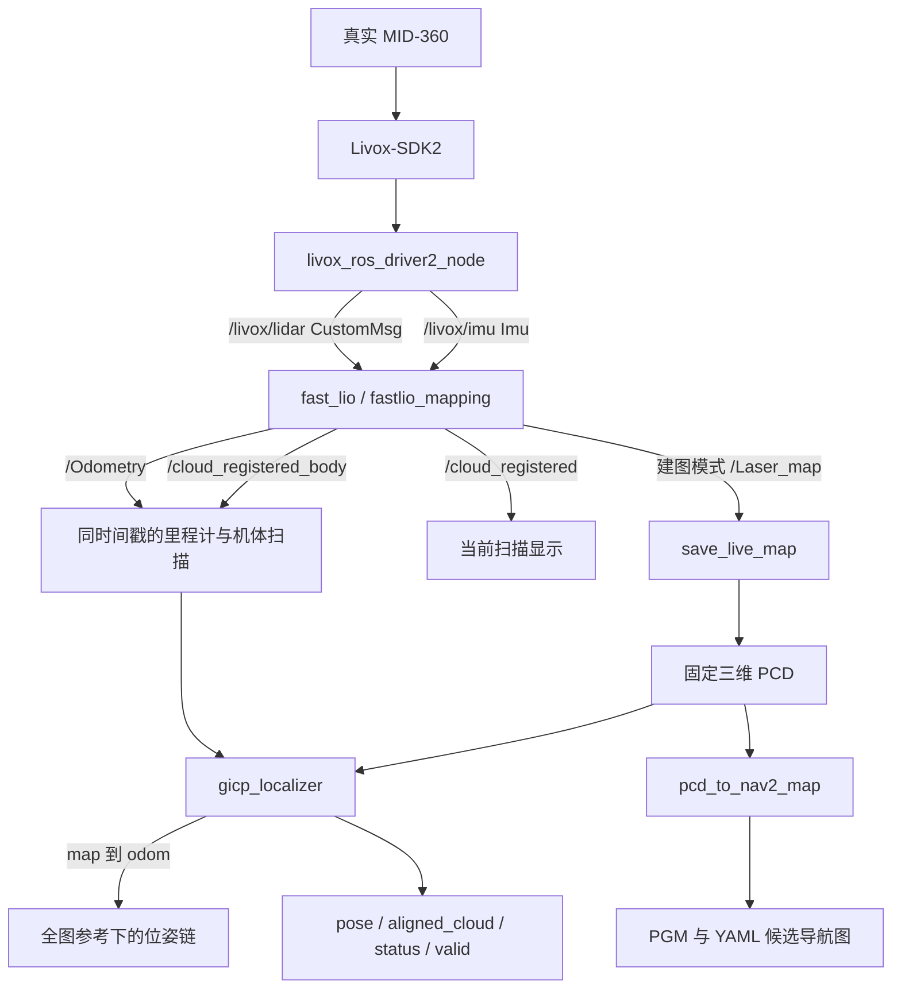

# 实机 MID-360 项目拆解与源码问题记录

> 2026-09-30 更新：本文主体保留 9 月 29 日的审查快照及当时源码行号。
> GICP 已按四层结构重构，原 `src/gicp_localizer.cpp` 已拆分；串行配准阻塞、
> 零戳判重、完成时负年龄、提交顺序、时间调度、ROI 和只读参数等已处理，
> 并新增局部几何退化检查。最新行为/验证以
> [GICP 重构记录](docs/GICP_REFACTOR_2026-09-30.md) 与包 README 为准。
> 下文“本轮仅文档/暂未修复”指 9 月 29 日；FAST-LIO 的 F01–F05
> 与初值时间传播、全局匹配歧义等未因此自动关闭。

审查日期：2026-09-29。工作区：`/home/ice/go2_ws`，源码根目录：`/home/ice/go2_ws/src`。

## 1. 当前决定与阅读入口

**保留当前可运行实现，本次只增加文档。** 用户当前报告运行正常；本轮只读核对源码，没有启动雷达、定位节点、Nav2 或电控，没有修改运行源码、launch 和参数，也没有重新构建。

认同先保留运行基线：改动未经回归可能引入新问题。运行正常能够证明已经经历的场景可用，不能覆盖首次传播、输入缺失、时钟变化和计算阻塞等路径。下面记录的“源码事实”与“实机故障”分开判断，不能据静态审查断言当前轨迹已经出错。

文档分工：

- [实机建图操作入口](README_REAL_MID360.md)：日常网络、启动、静置初始化、保存地图。
- [已有 PCD 上的 GICP 定位操作](go2_real_localization/README.md)：定位启动、初始位姿、质量日志、地图转换。
- 本文：整个实机链的源码结构、消息传播、坐标和时间关系，以及待验证的问题台账。

本文只拆解真实 MID-360 路径。共享包中的历史流程仅在解释接口边界时提及。

快速阅读：第 2–4 节看组件与启动关系，第 5 节看消息/时间/坐标，第 6–8 节看算法与地图产物，第 9–10 节看使用和构建，第 11 节看问题台账，第 12 节看导航缺口，第 13–14 节看验证边界与源码索引。

### 1.1 当前版本基线

| 源码目录 | 当前 Git HEAD | 说明 |
| --- | --- | --- |
| `unitree-go2-ros2` | `0c3d2e2f877d546002b782c0f35da08f223e1c8c` | 项目封装、实机配置、工具及 GICP 节点 |
| `FAST_LIO` | `440a8e3e909023b7cb084e99b0c5070e3baebe86` | XjuHurricaneQuadVision/FAST_LIO；已有本地补丁 |
| `livox_ros_driver2` | `13eb05e4e6dd7a765b934d0c5fd6236676a57b49` | Livox 驱动；已有设备时间戳补丁 |
| `Livox-SDK2` | `f5d9375f84efe2b15bc0a052d3e18482ed13adf4` | 雷达通信 SDK |
| `fast_gicp` | `0e7ec1441c99f7be453db2ea216d5de029387417` | koide3/fast_gicp，当前使用 CPU FastGICP |

**HEAD 不是当前工作区的完整快照。** 当前存在未提交修改，包括 FAST-LIO 的三个源文件、驱动时间戳文件，以及 GICP 日志和二维地图工具等改动。保存基线时需要连同工作区差异、配置、地图一起保存，不能只记录提交号。本文记录的是审查时的实际文件。

### 1.2 这两个主要 C++ 文件是谁写的

| 文件 | 当前来源 | 如何理解 |
| --- | --- | --- |
| `go2_real_localization/src/gicp_localizer.cpp` | 本项目在上述项目提交中新增；Git 作者为 `ice`，工作区另有诊断日志改动 | 项目自己组织的 ROS 节点逻辑；配准求解器来自第三方 fast_gicp。Git 作者不能进一步证明每一行的实际编写者 |
| `../FAST_LIO/src/laserMapping.cpp` | 第三方 FAST-LIO fork 的主体源码，加本地少量补丁 | EKF、ikd-tree、去畸变调用、累计地图逻辑不是本项目重新实现的算法 |

`laserMapping.cpp` 相对当前依赖 HEAD 的本地差异主要是时间倒退队列保护、日志和 `/Laser_map` 发布队列深度。累计 `publish_map()` 与 1 Hz 地图定时器已经在该依赖 HEAD 中，不能将它们都称为“我们自己写的”。

`IMU_Processing.hpp` 的本地补丁把初始化样本阈值从 10 改为 1000；`preprocess.cpp` 的补丁修正 CustomMsg 分支的近点过滤条件。第三方来源不等于所有边界路径都已正确验证。

## 2. 项目总体架构：建图、定位与地图转换

项目分成三个过程：

1. **实机建图**：MID-360 点云和 IMU → FAST-LIO → 当前扫描、里程计、累计房间点云 → 保存 PCD。
2. **已有地图定位**：同样用 FAST-LIO 提供局部运动和去畸变扫描；GICP 将扫描配准到旧 PCD，计算 `map → odom`。
3. **离线二维转换**：同一份三维 PCD → 地面与障碍物栅格 → PGM/YAML，供后续 Nav2 使用。



**当前 GICP 是“已知大致初值后，在整张地图参考系内持续定位”。** 节点加载完整 PCD，但每次只在初猜周围裁剪局部目标点云；没有在未知位置时遍历全场、自动寻找初值的功能。加载全地图不等于实现了自动全局重定位。

当前实机 bringup 到 GICP 输出为止，尚未启动导航规划或机器人运动控制。

## 3. 六个核心组件与文件职责

目录名、ROS 包名和可执行文件要区分：`FAST_LIO` 的 ROS 包名是 `fast_lio`。

| 所在目录（相对源码根目录） | 包名 / 主要产物 | 职责与关键文件 |
| --- | --- | --- |
| `Livox-SDK2` | `liblivox_lidar_sdk_shared.so` | 通信、收包和设备数据回调；部署时先独立编译到 `install/livox-sdk2` |
| `livox_ros_driver2` | `livox_ros_driver2` / `livox_ros_driver2_node` | SDK 数据转 ROS；`src/comm/pub_handler.cpp`、`src/lddc.cpp`、`msg/CustomMsg.msg`、`msg/CustomPoint.msg` |
| `FAST_LIO` | `fast_lio` / `fastlio_mapping` | IMU 初始化、传播、点云去畸变、点到平面更新、局部地图、里程计和点云输出 |
| `fast_gicp` | `fast_gicp` / `libfast_gicp.so` | PCL/Eigen/OpenMP 配准库；本项目不把它作为独立 ROS 定位节点启动 |
| `unitree-go2-ros2/go2_fastlio_localization` | 同名 Python 包 | 实机 launch/config、`save_live_map`、`check_stationary` 等工具 |
| `unitree-go2-ros2/go2_real_localization` | 同名 CMake 包 / `gicp_localizer` | 固定 PCD 定位、质量与有效期检查、TF、二维地图转换 |

主要封装文件：

```text
unitree-go2-ros2/
├── README_REAL_MID360.md
├── README_REAL_PROJECT_ANALYSIS.md
├── go2_fastlio_localization/
│   ├── launch/real_lidar.launch.py
│   ├── launch/real_fastlio.launch.py
│   ├── launch/real_mapping.launch.py
│   ├── config/mid360_real.json
│   ├── config/fast_lio_mid360_real.yaml
│   ├── config/real_mapping.rviz
│   ├── config/saved_map.rviz
│   └── go2_fastlio_localization/
│       ├── save_live_map.py
│       ├── check_stationary.py
│       └── fast_lio_odom_bridge.py
├── go2_real_localization/
│   ├── src/gicp_localizer.cpp
│   ├── launch/bringup.launch.py
│   ├── launch/localization.launch.py
│   ├── config/gicp.yaml
│   ├── rviz/localization.rviz
│   ├── tools/pcd_to_nav2_map.py
│   ├── tools/pcd_project_2d.py
│   ├── tools/setup_fast_gicp.bash
│   ├── fast_gicp.repos
│   └── test/
│       ├── synthetic_check.py
│       └── test_pcd_to_nav2_map.py
├── tools/setup_mid360_dependencies.bash
└── patches/
    ├── fast_lio_handheld.patch
    ├── fast_lio_timestamp_guard.patch
    └── livox_driver2_monotonic_clock.patch
```

`go2_fastlio_localization` 共享包中还保留历史脚本和依赖声明；实际 `real_*` launch 的包含关系决定当前实机运行链。不能仅根据包名或 `package.xml` 中的历史依赖判断某个节点已经在运行。

## 4. Launch 与配置怎样生效

### 4.1 实机建图入口

```text
real_mapping.launch.py
  ├─ real_lidar.launch.py
  │    └─ livox_ros_driver2_node + mid360_real.json
  └─ real_fastlio.launch.py
       └─ fast_lio/launch/mapping.launch.py
            └─ fastlio_mapping + fast_lio_mid360_real.yaml
```

- `real_lidar.launch.py` 设 `xfer_format=1`、`multi_topic=0`、`publish_freq=10.0`、`frame_id=livox_frame` 和 `use_sim_time=false`。
- `xfer_format=1` 输出 CustomMsg，包含逐点 `offset_time`，符合当前 FAST-LIO 输入。改成 0 并不只是换显示格式，还会改变点云消息类型。
- `real_fastlio.launch.py` 是上游 `mapping.launch.py` 的薄封装，传入本项目配置目录、配置文件和 RViz 配置。
- `real_mapping.launch.py` 组合前两个入口；分开启动和组合启动二选一。

### 4.2 实机定位入口与参数原文

```text
go2_real_localization/bringup.launch.py
  ├─ real_lidar.launch.py
  ├─ 直接启动 fast_lio/fastlio_mapping
  └─ localization.launch.py
       ├─ gicp_localizer
       └─ 可选 RViz
```

当前 `go2_real_localization/launch/bringup.launch.py` 第 23–26 行原文如下。此前将参数拆成多行讲解只是重新排版；这里以实际文件为准：

```python
        Node(package='fast_lio', executable='fastlio_mapping', output='screen', parameters=[
            LaunchConfiguration('lio_params'), {
                'use_sim_time': False, 'publish.map_en': False, 'pcd_save.pcd_save_en': False,
                'publish.scan_publish_en': True, 'publish.scan_bodyframe_pub_en': True}]),
```

先加载 `lio_params` 指定的 YAML，再用后面的字典覆盖同名参数。因此：

- 建图 YAML 原本 `publish.map_en=true`，完整定位 bringup 将其覆盖为 false。
- 定位模式保留当前扫描与机体扫描发布，供显示和 GICP 使用。
- 关闭累计地图输出和 PCD 保存不等于关闭 FAST-LIO 内部局部地图；内部 ikd-tree 仍用于估计运动。
- 单独启动 `localization.launch.py` 只加 GICP，**不会修改已运行 FAST-LIO 的开关**。附加在建图进程上时，原来的 `/Laser_map` 仍可能继续累计。

### 4.3 配置唯一入口与覆盖关系

| 配置 | 管什么 | Launch 覆盖入口 |
| --- | --- | --- |
| `go2_fastlio_localization/config/mid360_real.json` | 雷达 IP、主机 IP、UDP 端口、设备数据配置 | `user_config_path` |
| `go2_fastlio_localization/config/fast_lio_mid360_real.yaml` | FAST-LIO 输入、过滤、IMU 噪声、LiDAR–IMU 外参、地图与发布开关 | `lio_params`；定位 bringup 另覆盖发布/保存开关 |
| `go2_real_localization/config/gicp.yaml` | GICP 帧、配准与验收门限、初始位姿 | `params_file`；localization 另覆盖 `map_path` 与 `use_sim_time` |
| RViz 配置 | 固定坐标系、显示项与绘制负载 | `show_rviz` 控制是否启动 |

真实入口没有读取依赖包的示例 `FAST_LIO/config/mid360.yaml` 和 `livox_ros_driver2/config/MID360_config.json`。调参数要先确认当前 launch 实际传入哪个路径。

当前网络配置为主机 `192.168.1.50`、雷达 `192.168.1.111`。端口依次为命令 56100/56101、推送 56200/56201、点云 56300/56301、IMU 56400/56401（设备/主机）。换机器时以实际网络为准。

## 5. 消息传播链、时间戳与坐标关系

### 5.1 消息接口表

| 接口 | 类型 | 坐标 / 时间语义 | 发布 → 消费 |
| --- | --- | --- | --- |
| `/livox/lidar` | `livox_ros_driver2/msg/CustomMsg` | 原始 LiDAR 点；header 为包/帧基准时间，逐点有纳秒偏移 | 驱动 → FAST-LIO |
| `/livox/imu` | `sensor_msgs/msg/Imu` | IMU 测量；与点云使用同一设备时间转换规则 | 驱动 → FAST-LIO |
| `/Odometry` | `nav_msgs/msg/Odometry` | `odom → livox_frame` 的 IMU 位姿；扫描结束时间 | FAST-LIO → GICP |
| `/cloud_registered_body` | `sensor_msgs/msg/PointCloud2` | 去畸变、LiDAR 转 IMU 后的点；`livox_frame`；扫描结束时间 | FAST-LIO → GICP |
| `/cloud_registered` | `sensor_msgs/msg/PointCloud2` | 当前扫描在 `odom` 中；扫描结束时间 | FAST-LIO → RViz/检查 |
| `/Laser_map` | `sensor_msgs/msg/PointCloud2` | 累计输出点云，`odom`；建图模式启用 | FAST-LIO → 保存工具/RViz |
| `/path` | `nav_msgs/msg/Path` | `odom` 下的轨迹，当前源码每 10 帧记录一次 | FAST-LIO → RViz |
| `/initialpose` | `geometry_msgs/msg/PoseWithCovarianceStamped` | `map` 下当前 IMU 的近似位姿 | RViz/外部初值 → GICP |
| `/gicp/map` | `sensor_msgs/msg/PointCloud2` | 降采样固定 PCD，`map`；一次发布、transient local | GICP → RViz |
| `/gicp/aligned_cloud` | `sensor_msgs/msg/PointCloud2` | 最近通过检查的扫描，`map`；对应扫描时间 | GICP → RViz |
| `/gicp/pose` | `geometry_msgs/msg/PoseStamped` | 最近通过检查的 `map → IMU` 位姿；对应扫描时间 | GICP → 下游 |
| `/gicp/status` | `std_msgs/msg/String` | 原因、点数与配准测量日志 | GICP → 人工检查 |
| `/gicp/valid` | `std_msgs/msg/Bool` | 节点判断最近结果是否仍有效；消息没有 header | GICP → 后续健康检查 |
| `/tf` | TF | FAST-LIO 发 `odom → livox_frame`；GICP 发 `map → odom` | 两节点 → tf2/RViz/后续导航 |

### 5.2 时间从设备到配准如何传播

1. SDK 提供设备包时间。驱动 `pub_handler.cpp:265–292` 对未同步设备时间做一次 Unix 时间锚定，此后用设备时间差推进；PTP/GPS 模式使用对应设备时间。
2. 同一规则用于点云和 IMU。驱动出帧调度使用 steady clock，减少主机校时影响出帧周期。
3. `lddc.cpp:354–397` 生成 CustomMsg：`header.stamp`/`timebase` 是基准时间，`offset_time` 为点时间减去基准时间，单位纳秒。
4. `preprocess.cpp:180–181` 把逐点偏移除以 `1e6` 放入点的 `curvature` 字段，单位变为毫秒。这里的 curvature 被借作时间，不是几何曲率。
5. FAST-LIO 用 `header.stamp + curvature / 1000` 得到点时间/扫描结束时间，等 IMU 覆盖到扫描结束后处理。
6. 去畸变将点统一到扫描结束时刻，再发布完全同戳的 `/Odometry` 和 `/cloud_registered_body`。
7. GICP 的 ExactTime 只接收两路 header.stamp 完全相同的消息对；用这一时刻的里程计解算 `map → odom`。

`preprocess.timestamp_unit=3` 不负责当前 CustomMsg 的上述偏移换算；它在 PointCloud2 处理分支生效。不能靠改这个参数修 CustomMsg 的时间问题。

设备时间锚定并不让所有时效判断自动免疫主机校时：GICP 仍将节点 `now()` 与消息头比较。设备重启或时间模式改变后，应重启整条实机链；当前队列保护没有保证全状态自动恢复。

### 5.3 Frame 名称与三种外参

在该 FAST-LIO fork 中，输出 `livox_frame` 实际对应 **IMU 机体坐标系**。原始 LiDAR 消息也使用这个 frame 名称，容易混淆；判断原点应看具体处理函数，不能只看字符串。

定义 `T_A_B` 为“将 B 坐标中的点变到 A 坐标”的刚体变换：

```text
p_IMU  = R_IMU_LiDAR × p_LiDAR + t_IMU_LiDAR
p_odom = T_odom_IMU × p_IMU
T_map_odom = T_map_IMU × inverse(T_odom_IMU)
T_map_IMU  = T_map_odom × T_odom_IMU
```

当前定位 TF 链：

```text
map  -- GICP -->  odom  -- FAST-LIO -->  livox_frame（IMU）
```

三个概念不能混用：

- 驱动 JSON 的设备外参：当前为零值配置。
- FAST-LIO `extrinsic_T/R`：将 LiDAR 点转换到 IMU 的外参；当前平移 `[-0.011, -0.02329, 0.04412]` m，旋转单位阵。
- 安装到 Go2 后的 IMU–机器人机体外参：需要根据真实安装测量；当前实机链尚未接入 `base_link/base_footprint`。

`gicp.yaml` 的 `initial_pose` 是当前 IMU 在旧地图中的位姿，单位米/弧度，顺序 `[x,y,z,roll,pitch,yaw]`；它不是安装外参。

保存的 PCD 保留建图那次启动的 `odom` 数值。新一次定位将这个固定参考称为 `map`，用 GICP 连接新 `odom`。PCD 文件没有保存 ROS frame 元数据，`z=0` 也不保证是地面。

## 6. FAST-LIO：从原始数据到里程计和地图

### 6.1 输入、初始化与去畸变

| 阶段 | 当前源码位置 | 关键逻辑 |
| --- | --- | --- |
| LiDAR 回调 | `../FAST_LIO/src/laserMapping.cpp:315–355` | 预处理 CustomMsg，缓存点云与基准时间；检测时间倒退 |
| IMU 回调 | 同文件 `358–388` | 时间偏移、缓存 IMU；检测时间倒退 |
| 同步 | 同文件 `393–444`，`sync_packages()` | 算扫描结束时间，等待 IMU 覆盖，再组成 MeasureGroup |
| 点筛选 | `../FAST_LIO/src/preprocess.cpp:166–193` | line/tag 检查、每 2 点取样、0.8 m 盲区、保留逐点时间 |
| 初始化 | `../FAST_LIO/src/IMU_Processing.hpp:156–209` | 多个 IMU 样本均值估计重力方向与陀螺零偏，设置外参和协方差 |
| 传播与去畸变 | 同文件 `213–334` | 分段 IMU 积分、保存姿态轨迹，将点按采样时刻补偿到扫描结束 |

当前 `MAX_INI_COUNT=1000` 是样本计数阈值，**没有额外的自动静止检测器**。因此实际使用仍要求静置到 `IMU Initial Done`。增加样本数不能自动把运动中的初始化变正确。

去畸变同时考虑旋转、平移和 LiDAR–IMU 外参。它输出的是统一到扫描结束时刻的 LiDAR 点；发布机体云时再转到 IMU 坐标。

### 6.2 配准更新与内部局部地图

主处理定时器在 `laserMapping.cpp:967–1118`；名义调度频率 100 Hz，实际扫描处理受当前约 10 Hz 输入约束：

```text
sync_packages
 → ImuProcess::Process
 → 局部地图窗口管理
 → 扫描体素降采样
 → 首帧建立 ikd-tree
 → 迭代 EKF 点到平面更新
 → 发布当前里程计
 → map_incremental 更新内部树
 → 发布当前扫描、机体扫描及轨迹
```

`h_share_model():687–804` 是观测模型核心：

1. 用当前估计与外参把扫描点变到 `odom`。
2. 在 ikd-tree 中找近邻，拟合局部平面。
3. 计算 `n·p + d` 点到平面残差，筛除不合格点。
4. 构造对位姿的雅可比，交给迭代 EKF 更新状态。
5. 当前 `extrinsic_est_en=false`，外参保持配置值，不在线估计。

`map_incremental():448–494` 按更新后的位姿插入扫描点；局部窗口管理在 `232–281` 删除远离窗口的区域。此地图用于相邻扫描估计运动，没有回环优化，也不读取旧房间 PCD 进行绝对定位。

### 6.3 三种点云产物的区别

| 产物 | 来源 | 特性 |
| --- | --- | --- |
| `/cloud_registered_body` | 本次去畸变云 → IMU | GICP 源点云；不会把整张房间地图拿来匹配自身 |
| `/cloud_registered` | 本次云 → 当前 `odom` | 观察当前扫描是否稳定 |
| `/Laser_map` | 1 Hz 定时器把当时的已配准扫描追加到 `pcl_wait_pub` | 累计输出，用于房间展示和保存 |

`/Laser_map` **不是直接导出 ikd-tree，也不是把全部 10 Hz 扫描逐帧保存**。其累计点数随运行时间增长；累计不会消除位姿漂移或动态物体。1 Hz 采样和内部局部树是两条不同的数据路径。

当前 `dense_publish_en=true` 使用较密当前点云；内部配准仍有体素降采样。更密的显示不代表更高定位精度。

### 6.4 当前建图参数含义

| 参数 | 当前值 | 含义 |
| --- | --- | --- |
| `point_filter_num` / `max_iteration` | 2 / 3 | 点抽样与迭代更新次数 |
| `filter_size_surf` / `filter_size_map` | 0.10 m / 0.10 m | 扫描与内部地图体素尺度 |
| `preprocess.blind` | 0.8 m | 雷达原点附近的近点过滤；不是完整人体/机身剔除 |
| `cube_side_length` | 200 m | 局部地图窗口边长，需大于 `3 × det_range` |
| `mapping.det_range` | 40 m | 局部地图管理参数；没有实现超过 40 m 全部硬裁剪 |
| `preprocess.scan_rate` | 10 Hz | 扫描频率提示，不是量程 |
| `time_sync_en` / `time_offset_lidar_to_imu` | false / 0 | 不启用内部简单同步；依赖驱动的共同时间基础 |
| `extrinsic_est_en` | false | 使用配置外参 |
| `publish.map_en` | 建图 true，定位 bringup false | 控制累计输出，不控制内部 ikd-tree |
| `pcd_save.pcd_save_en` | false | 日常通过独立保存工具另存 PCD |

## 7. GICP：源码状态机与配准步骤

### 7.1 节点启动与输入

`gicp_localizer.cpp` 的项目职责是把 fast_gicp 包装成有时间、帧和质量约束的 ROS 节点：

- `48–73`：读取并检查参数。
- `74–86`：读 PCD、去非有限点、体素过滤、构建验收用地图 KD-tree，创建输出。
- `87–101`：参数初值或 `/initialpose`。收到有效 map 初值后进入 pending，等第一次配准接受。
- `102–119`：ExactTime 配对扫描与里程计，检查 frame 和时间顺序，缓存最新 pair。
- `106–107`：1 s 配准定时器、50 ms TF/时效定时器。

每次处理最新输入，不累积历史扫描。新初值会重置初始化状态；发生配对时间回退需要重新给初值。FAST-LIO 重启时应一并重启 GICP，避免新旧里程计原点混用。

### 7.2 一次 match 的完整过程

`match():130–193`：

1. 检查消息时效、是否有初值/已初始化、扫描是否已经处理。
2. 读取同戳 `T_odom_IMU`；首次用 seed，后续用 `T_map_odom × T_odom_IMU` 预测 map 位姿。
3. 对源扫描去非有限点、0.10 m 体素降采样。
4. 以预测位置为中心，从完整地图裁剪半径 25 m 的目标云，检查点数。
5. 创建 CPU `fast_gicp::FastGICP`，设置线程、迭代、对应距离，执行 `align(guess)`。
6. 检查是否收敛、矩阵是否有限；用对齐点到固定地图的最近邻另算内点比例和 RMSE。
7. 检查相对于 guess 的平移/旋转修正和结束时输入年龄。
8. 通过才更新 `map_odom`、输出 map 位姿/对齐云，并标记 valid；拒绝则报告原因、停止有效 TF 发送。

矩阵关系在“同时间戳 IMU 云 + IMU 位姿”契约下是正确的：

```text
GICP 输入：p_IMU 与固定地图 p_map
GICP 结果：T_map_IMU
输出修正：T_map_odom = T_map_IMU × inverse(T_odom_IMU)
```

这是固定旧地图对局部里程计的修正；没有修改 FAST-LIO 内部轨迹，没有回写 EKF，也没有完成地图回环。

### 7.3 当前参数与验收门

| 配置项 | 当前 YAML 值 | 含义 |
| --- | --- | --- |
| `voxel_size` / `local_radius` | 0.10 m / 25 m | 源/地图体素与目标裁剪半径 |
| `registration_period` | 1.0 s | 名义配准周期 |
| `max_input_age` / `transform_timeout` | 2.0 s / 3.0 s | 配准输入年龄门；相对最近接受扫描时间戳的保持时效 |
| `max_iterations` / `num_threads` | 40 / 4 | FastGICP 内部计算配置 |
| `correspondence_distance` | 1.0 m | 优化器对应点距离上限 |
| `inlier_distance` | 0.30 m | 配准后验收最近邻距离门 |
| `min_inlier_ratio` / `max_rmse` | 0.60 / 0.20 m | 内点数/源点数下限；内点距离 RMS 上限 |
| `min_points` | 100 | 源云/目标云点数下限 |
| 后续修正平移/旋转上限 | 0.5 m / 0.35 rad | 限制对预测的单次修正 |
| 首次修正平移/旋转上限 | 2.0 m / 0.8 rad | 首次初猜允许更大修正 |
| `initial_pose_enabled` | false | 默认等待 `/initialpose` |

C++ 的体素回退默认值 0.15 m 不是加载当前 YAML 后的生效值。优化器的平移步长收敛阈值为 0.0005 m；它不是定位误差门限。

`hasConverged()`、内点率、RMSE、修正量和时效共同决定是否接受，但仍不能排除重复走廊等几何歧义。不存在“通过门限就已证明绝对位置正确”的推论。

### 7.4 日志与 TF 的真实含义

| 输出量 | 含义 |
| --- | --- |
| `scan_points` | FAST-LIO 输出的机体扫描点数，非原始 UDP 点数 |
| `source_points` | 有限点与体素过滤后的源点数 |
| `map_points` / `target_points` | 全图降采样点数 / 当前裁剪目标点数 |
| `aligned_points` / `inlier_points` | 对齐后的全部点 / 通过最近邻门的点 |
| `inlier_ratio` | 内点数除以源点数 |
| `rmse_m` | 内点到地图最近邻距离的 RMS，单位 m；不是独立真值下的定位误差 |
| `registration_ms` | 仅 `gicp.align()` 的 steady-clock 耗时；不含排队、裁剪、消息传输和全部验收 |

50 ms 定时器有效时重复发送最近 `map → odom`，时间戳用当前 now。**20 Hz TF 不代表 20 Hz 重新配准。** 配准失败或过期时停止新 TF，tf2 缓存和 RViz 的旧云仍可能存在。

`/gicp/valid` 是无 header 的 Bool，最后一次 true 也可能被消费者一直保留。未来运动控制需要同时检测有效性与更新超时；详情见问题 G03/G04。

## 8. 保存 PCD 与生成二维地图

### 8.1 save_live_map 保存的究竟是什么

`go2_fastlio_localization/save_live_map.py:9–47`：

```text
订阅 /Laser_map
 → 等下一条消息（默认最多 45 s）
 → 按字段 offset、point_step、row_step 解析 float32 XYZ/intensity
 → 去非有限 XYZ
 → 写二进制 PCD
 → 打印 SAVED、POINTS、BYTES、FRAME
```

默认输出 `~/go2_maps/real_room_时间戳.pcd`；用独占创建避免覆盖同名文件。它保存一次累计输出快照，没有重新优化全部历史，也没有要求上游导出内部树。

必须在建图仍运行时保存，看到 `SAVED` 再停止。定位 bringup 关闭 `/Laser_map`，在该模式下运行保存工具会等不到地图。上游 `/map_save` 受 `pcd_save_en` 开关限制，不是当前默认操作入口。

### 8.2 当前二维转换器

使用 `go2_real_localization/tools/pcd_to_nav2_map.py`，通过 CMake 安装成：

```text
ros2 run go2_real_localization pcd_to_nav2_map
```

根 README 中旧包的同名命令属于另一条历史工具链。`pcd_project_2d.py` 输出高度带投影点云，也不等于这里的 PGM 占用图。

当前转换器接受未压缩二进制 PCD，主要步骤：

1. 解析 XYZ、去非有限点；按 XY 分位数或显式 bounds 裁剪。
2. `relative_z = point_z - floor_z`。`floor_z` 是该 PCD 中实测的地面绝对 z。
3. `abs(relative_z) <= floor_tolerance` 计为地面证据；指定相对高度带中的点计为障碍。
4. 按栅格累积命中：有地面证据且无障碍命中的格子为自由；达到障碍门限为占用；其余为未知。
5. 输出 PGM：黑 0=占用、白 254=自由、灰 127=未知；按图像行方向翻转 Y。
6. 输出 YAML：resolution、`origin=[xmin,ymin,0]`、阈值与图像路径。origin 的第三项是 yaw，不是地面高度。

当前默认 resolution=0.05 m、floor_tolerance=0.10 m、障碍高度 0.15–1.50 m、命中下限 1、free_radius=0。工具拒绝覆盖已有输出。

地面证据不证明整个机器人轮廓可通行；稀疏、被遮挡区保持未知。扩大 `free_radius` 是显式扩展地面证据，不能当作新的实际观测。

三维 PCD 与二维图必须保持同一 map 坐标、来自同一地图，不能为了图像好看单独旋转/平移后不记录变换。`docs/CHANGELOG_2026-09-27.md` 的“框内无障碍全当自由”描述旧版行为；当前源码已是上述三态逻辑。

## 9. 怎样使用当前源码：运行索引

以下是现有入口的说明，本轮没有执行这些命令。每个参与终端先加载相同环境：

```bash
cd ~/go2_ws
source /opt/ros/humble/setup.bash
source install/setup.bash
unset ROS_DOMAIN_ID ROS_LOCALHOST_ONLY
```

### 9.1 建图并保存

组合入口：

```bash
ros2 launch go2_fastlio_localization real_mapping.launch.py
```

或者两个终端分开启动：

```bash
# 终端一
ros2 launch go2_fastlio_localization real_lidar.launch.py
```

```bash
# 终端二
ros2 launch go2_fastlio_localization real_fastlio.launch.py
```

静置到初始化完成，再平稳移动。没有桌面时可给 FAST-LIO/组合入口加 `show_rviz:=false`。需要保存时另开环境相同的终端：

```bash
ros2 run go2_fastlio_localization save_live_map
```

### 9.2 在已有 PCD 中定位

尚未启动驱动和 FAST-LIO：

```bash
ros2 launch go2_real_localization bringup.launch.py \
  map_path:=/home/ice/go2_maps/实际地图.pcd
```

如果二者已运行，只添加定位节点：

```bash
ros2 launch go2_real_localization localization.launch.py \
  map_path:=/home/ice/go2_maps/实际地图.pcd
```

地图路径必须明确指定。不要叠加两个驱动、两个 FAST-LIO 或多个 `map → odom` 发布者。

默认在 RViz 给 2D Pose Estimate，给初值后保持静止直至首次 ACCEPTED。2D 工具的 z=0 仅适合当前 IMU 高度接近旧地图初始化高度的情形；高度/倾斜不同则用 YAML 六自由度初值。

```bash
ros2 topic echo /gicp/status std_msgs/msg/String --qos-durability volatile
ros2 topic echo /gicp/valid
ros2 run tf2_ros tf2_echo map livox_frame
```

### 9.3 离线转换已有地图

以下仅是现有文档中已测地面高度的示例；`-0.75` 不能推广到其他 PCD。输出前缀需用未存在的文件名：

```bash
ros2 run go2_real_localization pcd_to_nav2_map \
  /home/ice/go2_maps/real_room_20260926_110555_607459.pcd \
  --floor-z=-0.75 --floor-tolerance=0.10 \
  --obstacle-min-height=0.15 --obstacle-max-height=1.50 \
  --output-prefix=/home/ice/go2_maps/新的候选地图名
```

转换成功只说明产物已写出；要核对实际布局、未知区域、起点与目标的自由区域连通性。它不启动 Nav2。

### 9.4 检查工具：适用输入与边界

| 工具 | 当前实机用途 | 不能忽略的限制 |
| --- | --- | --- |
| `ros2 run go2_fastlio_localization check_stationary` | 静置时统计 `/Odometry` 的首末位移、相对首帧最大位移和姿态差 | 不自动判断传感器是否静止，不读取 GICP，不证明绝对精度；默认 65 s 为墙钟采样期，消息覆盖时长另算 |
| `tools/check_mid360.py` | 指定当前 PointCloud2 话题和 frame 后，检查非空/XYZ/帧与接收频率 | 默认 `/livox/lidar`、`mid360_link` 不适配当前 CustomMsg 实机入口；默认运行没消息不等于驱动故障 |
| `tools/view_mid360_3d_map.bash` | 保留的旧查看入口 | 使用示例地图、旧固定 TF，并复用 `/cloud_registered`；未适配当前实机 PCD 的坐标关系，不直接用来验收当前链 |
| `fast_lio_odom_bridge` | 保留的导航适配代码，当前 real launch 未使用 | 缺真实机体外参/速度适配，详见第 12 节 |

基础 PointCloud2 检查可在本仓库根目录使用：

```bash
python3 tools/check_mid360.py \
  --topic /cloud_registered_body --frame livox_frame
```

该工具的频率是 monotonic 接收时间计算的频率，不检查逐点 offset_time、IMU 同步、去畸变或定位精度。`saved_map.rviz` 是显示资源，不能仅凭资源存在推断已有正确的实机地图加载与 TF 发布入口。

## 10. 构建、安装与部署关系

### 10.1 从源码到可执行文件

| 组件 | 构建/安装关系 |
| --- | --- |
| Livox-SDK2 | `setup_mid360_dependencies.bash` 先 CMake 安装到 `install/livox-sdk2`，供驱动链接 |
| livox_ros_driver2 | ROS 消息生成、C++ 驱动、链接 SDK |
| fast_lio | `CMakeLists.txt:94` 将 `laserMapping.cpp`、ikd-tree 和 preprocess 编成 `fastlio_mapping`；依赖 PCL/Eigen/ROS/Livox 消息 |
| go2_fastlio_localization | `setup.py:9–10` 安装 launch/config，console_scripts 注册保存和检查工具 |
| fast_gicp | CPU PCL/Eigen/OpenMP 配准库；本链不要求 CUDA |
| go2_real_localization | `CMakeLists.txt:15–23` 编译 GICP C++ 节点，安装 launch/config/RViz 与 `pcd_to_nav2_map` |

Launch 通过 ament 查找 **安装目录** 的 package share；不是直接以当前 shell 的源码目录查找资源。当前 symlink install 下，已核对定位 bringup 安装路径链接到对应源码文件。

C++ 修改需要重建才能影响可执行文件；Python/配置是否即时生效取决于安装方式及节点是否重新启动。分析源码正确，不等于已证明当前运行二进制与源码完全一致。

### 10.2 已有环境的增量构建参考

当前冻结运行版本，不需要为了阅读本文执行构建。以后确认有必要时可分别使用：

```bash
cd ~/go2_ws
source /opt/ros/humble/setup.bash
colcon build --base-paths src \
  --packages-select livox_ros_driver2 fast_lio go2_fastlio_localization \
  --symlink-install --cmake-args -DCMAKE_BUILD_TYPE=Release
source install/setup.bash
```

```bash
colcon build --packages-select fast_gicp go2_real_localization \
  --symlink-install --cmake-args -DCMAKE_BUILD_TYPE=Release \
  -DBUILD_VGICP_CUDA=OFF -DBUILD_apps=OFF -DBUILD_test=OFF
source install/setup.bash
```

### 10.3 新机器部署脚本与现有环境的区别

`tools/setup_mid360_dependencies.bash` 是一揽子部署脚本：固定第三方版本、应用补丁、准备 SDK、rosdep 和工作区构建。它要求已有 ROS 2 Humble 环境，还包含全仓其他依赖。

其 `clone_at_commit():27–57` 会把有修改的依赖 checkout 移到 `dependency_backups` 后重新准备源码。虽然保留备份，仍会改变当前依赖现场；**不能把完整 setup 当作每次启动前的日常命令**。

`go2_real_localization/tools/setup_fast_gicp.bash` 检查固定版本；HEAD 检查本身不验证全部未提交文件。新小电脑应在目标机器编译，不直接复制 WSL 的 install；网络 JSON 使用目标机实际 IP。

当前工作区 SDK 路径是 `install/livox-sdk2`。同名 `fast_lio` 的旧仓库不要重新放回 src 同时参与 colcon；备份应在源码构建范围外或有 COLCON_IGNORE。

## 11. 源码问题台账：全部记录，暂未修复

统一状态：**源码证据已核对；触发条件已分析；本轮未运行复现；未证明与当前实机异常存在因果关系；保留现有实现。** 以下“验证”是未来隔离验证建议，不是本轮已完成项。

分类：

- **源码缺口**：初始化、条件或发布顺序有明确代码证据。
- **条件性风险**：需特定输入/生命周期才影响结果。
- **设计限制**：当前实现的能力或使用约束，不等于算法公式错误。

| 编号 | 项目 | 分类 | 主要涉及场景 |
| --- | --- | --- | --- |
| F01 | 上一帧结束时间未初始化 | 源码缺口 | IMU 初始化后的首次传播 |
| F02 | 空 IMU 组可能复用旧点云 | 条件性控制流缺口 | 输入缺口、时间错位、旧扫描积压 |
| F03 | Odometry 先发布再填协方差 | 发布顺序缺口 | 消费协方差的下游 |
| F04 | 累计图缺少新帧与快照约束 | 条件性风险 | 输入暂停、等待 IMU、处理失败 |
| F05 | 时间倒退只清局部缓存 | 恢复边界限制 | 设备重启、时间模式变化 |
| G01 | 完成配准后遗漏负年龄检查 | 条件检查缺口 | 配准期间节点时钟回拨 |
| G02 | 初值未按时间传播到扫描 | 初值接口限制 | 初值延迟、首次接受前运动 |
| G03 | 串行配准阻塞时效检查 | 执行模型限制 | 高点数、长配准、回调排队 |
| G04 | TF/Bool/显示可保留旧状态 | 消费接口限制 | 失效、断流、节点退出 |
| G05 | ExactTime 对输入同戳有严格要求 | 输入契约 | 异戳、丢包、订阅延迟 |
| G06 | 局部配准不能自动全场找初值 | 能力与几何限制 | 未知位置、重复结构 |

### F01：上一帧结束时间未初始化

- **证据**：`IMU_Processing.hpp:78` 声明 `double last_lidar_end_time_`；构造函数 `84–99` 和 `Reset():103–116` 未赋值；`249`、`262–264` 先读取，`299` 才赋当前扫描结束时间。
- **触发**：初始化完成后首次进入 `UndistortPcl()`。
- **正常运行为什么可能看不出来**：尚未测量实际初值；内存值偶然不影响分支，且第一次处理后已写有效时间，可能掩盖问题。C++ 语义没有保证初值为零。
- **影响边界**：首次 IMU 传播可能跳过数据或计算异常 dt；不能据此认定它已导致当前倾斜/跳变。
- **后续验证**：隔离副本中检查未初始化读取，记录首次 IMU 区间/dt，覆盖多次冷启动；验收需显式定义首次传播起点。

### F02：空 IMU 组可能复用旧点云

- **证据**：`laserMapping.cpp:395` 只保证队列非空；`431–439` 收集扫描结束前的 IMU，某些时间排列可收不到样本，但 `441–444` 仍消费扫描并返回 true。`IMU_Processing.hpp:344` 遇空组直接 return，不清输出；主循环 `989–997` 仅检查缓存云是否为空。
- **触发**：已有一次有效去畸变结果；某帧队首 IMU 时间不早于扫描结束，最终组为空。
- **正常运行为什么可能看不出来**：连续且时间一致的 IMU 通常覆盖每帧；初始化前缓存为空也不会复用旧云。
- **影响边界**：条件成立时，旧扫描可能带新时间戳继续配准、插图和发布；不是每帧必然发生。
- **后续验证**：先输入有效帧，再输入新扫描及全部晚于其结束的 IMU；核对是否输出带新戳的旧云。失败帧应明确禁止使用旧结果。

### F03：Odometry 发布早于协方差填写

- **证据**：`laserMapping.cpp:644` publish，随后 `645–655` 才取当前 EKF P 并写 covariance。
- **触发**：每次里程计发布。首条协方差为消息默认零，后续滞后一轮。
- **正常运行为什么可能看不出来**：位姿已填写；稳定时相邻 P 差异小。当前 GICP `gicp_localizer.cpp:138` 只使用 pose，不消费 covariance。
- **影响边界**：下游收到的位姿与协方差时刻不一致；不说明 EKF 内部 P 算错。
- **后续验证**：比对同一发布序号的当前 P 和消息 covariance，要求完整填充后再发布。

### F04：累计地图缺少新帧标记与完成帧快照

- **证据**：`laserMapping.cpp:952–953`/`1120–1123` 每秒调用 publish_map；`593–603` 用缓存扫描与全局状态追加，不检查新帧；`608` 用全局 lidar_end_time。同步 `406/411/416` 先改该时间，`425–427` 又可能等待 IMU 而返回。
- **触发**：map_en=true 时输入暂停，或已有待处理扫描但 IMU 未到，或某帧处理失败。
- **正常运行为什么可能看不出来**：连续 10 Hz 输入通常每秒有新云；重复点落在原位置，肉眼不易区分。
- **影响边界**：无新数据仍可能增加点数；旧云/旧状态可能标注待处理帧的时间。不等于已经证明墙面重影的原因。
- **后续验证**：暂停输入检查累计点数；单独延迟 IMU，记录扫描编号/位姿/戳是否同属已完成帧。要求每个新帧最多追加一次，保存一致快照。
- **性质**：当前单线程 spin 下这是缓存生命周期问题，没有证据称为多线程竞态。

### F05：时间倒退保护不等于全状态恢复

- **证据**：`laserMapping.cpp:321–328` 清雷达和时间队列、重置待处理标志；`376–381` 清 IMU 队列；没有同时重建全部另一输入、上次 IMU、传播端点、EKF、内部树及累计图。
- **触发**：设备重启、同步模式变化或输入进入不同时间区间。
- **正常运行为什么可能看不出来**：现有驱动设备时钟补丁减少主机校时造成消息头回退的机会。
- **影响边界**：清队列补丁确实解决了部分队列失配，但没有保证重启后自动重新定位/建图；不能简单称该补丁错误。
- **后续验证**：隔离输入分别注入雷达、IMU、两路共同回退，检验明确停止或一致状态重建。当前继续遵循设备重启后重启整条链的操作约束。

### G01：配准完成门遗漏 age 非负约束

- **证据**：`gicp_localizer.cpp:132–133` 入场要求 `0 <= age <= max_age`；`176–177` 完成门只检查 `age <= max_age`。
- **触发**：入口检查后、完成检查前，节点时钟回拨到扫描戳之前，且其他质量门通过。
- **正常运行为什么可能看不出来**：持续正常时钟下 age 非负，两处条件效果一致。
- **影响边界**：可能先发 ACCEPTED/valid=true、新 pose 和 aligned_cloud；之后 `broadcast():197–198` 才将负 age 判失效。不能写成必然持续发布错误 TF。
- **后续验证**：可控时钟覆盖负 age、零、门限和超限，断言负 age 不发布接受结果。当前合成测试未覆盖。

### G02：初始位姿未补偿到扫描时间

- **证据**：`96–101` 未使用 `/initialpose.header.stamp`；`139` pending 直接用固定 seed，不随里程计传播。covariance 也未使用，后者是已声明的接口选择。
- **触发**：初值消息延迟，或给初值后到首次接受前运动；也可能先处理仍新鲜的旧缓存 pair。
- **正常运行为什么可能看不出来**：给初值后保持静止时，seed 与后续扫描位置近似一致。
- **影响边界**：初猜可能对应另一时刻，降低成功率或增加错配风险；不说明 map_odom 公式错误。
- **后续验证**：同一运动输入比较同期/延迟初值，核对 seed 与 scan 时刻。现有合成测试只用参数 seed，未发送 `/initialpose`。

### G03：串行 align 会延后 TF 与失效检查

- **证据**：`106–107` 两个 timer、订阅回调和 `158` align 由 `220` 默认串行 spin 执行；num_threads=4 只用于 FastGICP 内部计算。
- **触发**：转换/裁剪/align/验收耗时长，或执行器负载造成排队。
- **正常运行为什么可能看不出来**：当前地图和机器负载可能足够低，尚未测量最坏延迟。
- **影响边界**：输入、TF 广播和 ttl 检查一起延后，valid 可能晚于实际过期才更新。1 s/50 ms 是配置周期，不是实时延迟上限；没有已确认数据竞争。
- **后续验证**：隔离回放记录输入戳、处理开始/结束、TF 与 valid 接收时间，加高点数/负载验收真正端到端时效。registration_ms 单独不足以验收。

### G04：停止 TF 不撤回缓存和最后一次 Bool

- **证据**：`195–202` 有效期内按 now 保持 map_odom，失败停止发送但不删除缓存；旧 pose/云不撤回；valid 没有 header。
- **触发**：断流、拒绝、长时间阻塞或节点停止后，下游继续使用缓存。
- **正常运行为什么可能看不出来**：节点持续健康更新时，缓存与当前状态接近。
- **影响边界**：RViz 仍见绿色云、能查询到旧 TF、最后 Bool 为 true，都不能单独证明定位仍有效。
- **后续验证**：接受后分别停输入、停节点、增加负载，检查新 TF 停止时间和消费者超时动作。下游必须有独立接收超时检测。

### G05：ExactTime 是当前输入契约

- **证据**：`27`、`102–105` 使用 ExactTime；上游 `laserMapping.cpp:569,642` 当前两路都用 lidar_end_time。
- **触发**：更换输入源产生异戳，某路丢包或回调长期排队。
- **影响边界**：没有完整 pair 就不会进入配准；**不是已确认选错同步器**。当前同戳设计有源码依据。
- **后续验证**：记录配对率及丢包/戳偏移原因；不要未经分析就改 ApproximateTime，使不同时刻的位姿和扫描参与公式。

### G06：初值依赖与重复结构歧义

- **证据**：`139` 用 seed/里程计预测，`140–147` 局部裁剪，`167–177` 用几何距离与修正门验收；没有全图初值搜索。
- **触发**：未知初始位置、初猜偏离目标区域、重复走廊或相似房间。
- **正常运行为什么可能看不出来**：近似正确初值、结构丰富区域可正常收敛。
- **影响边界**：无法自动完成未知位置的全场恢复；几何相似场景可能有通过门限的错误局部极值。
- **后续验证**：用独立测量真值验证不同初值、重复结构与移动路径。是否增加全局检索属于另一个功能决定，不通过放宽当前门限替代。

## 12. 实机导航还缺哪些工作

这是能力与接口缺口，不能当作当前建图/GICP 运行故障。

| 工作 | 当前已有 | 还要完成的接口/证据 |
| --- | --- | --- |
| 机器人坐标与安装标定 | `map → odom → IMU` | 实测 IMU–机体外参，确定导航用 base_link/base_footprint，统一坐标与 TF 发布职责 |
| 导航里程计 | `/Odometry` 有 IMU 位姿 | 输出机体原点位姿与正确坐标下速度；原始输出 twist 未填写，旧 bridge 不能补出真实速度 |
| 静态导航地图 | PCD 和当前 PGM/YAML 转换器 | 用同一 PCD 审核地面高度、障碍高度、连通性和 origin，选择正确候选图 |
| 实时障碍感知 | 原始 CustomMsg 和去畸变 PointCloud2 | 地面/机身过滤、适合机器人高度的障碍层；若用 LaserScan，接入 PointCloud2 转换与正确 TF |
| 实机 Nav2 启动与参数 | 仓库有历史导航文件 | 独立真实入口，use_sim_time=false，正确地图/odom/base/sensor、footprint、运动约束和生命周期管理 |
| 控制到 Go2 | 当前实机 bringup 未接运动 | 明确 `/cmd_vel` 到 Go2 SDK/DDS/Sport 控制的桥接、频率和坐标约定 |
| 定位/通信失效停机 | GICP 有 status/valid | 消费 valid、独立接收超时、命令超时与停机行为；节点阻塞/退出也须覆盖 |
| 运动验收 | 用户报告当前建图/定位正常 | 独立位姿测量、低速路径、转弯、动态障碍、失效与恢复的实际证据 |

### 12.1 旧 bridge 不能直接当实机适配完成

`fast_lio_odom_bridge.py` 不在当前 real launch 中。它复制位置/yaw、将 z 清零，并转发原消息 twist；没有应用真实 IMU–机体外参，也没有接 GICP 健康状态。当前原始 twist 为零，因此直接复制也不会获得正确速度。

未来 TF 要统一设计：不要同时保留 `odom → IMU`，又在另一棵树把 IMU 设为 `base_link` 的子节点，造成同一 frame 有两个父节点。可以按选定机体关系重构输出职责，但需先明确外参方向、重力对齐和三维到二维语义。

### 12.2 障碍输入与控制链

实时障碍可从 `/cloud_registered_body` 的 PointCloud2 或适配后的传感器点云获取；原始 CustomMsg 不能直接作为普通 PointCloud2 交给点云转扫描节点。累计 `/Laser_map` 不适合作为实时障碍传感器。

目标链应形成：

```text
固定 PGM/YAML + 实时障碍 + map/odom/base TF + 有效机体里程计
 → Nav2 规划/控制
 → cmd_vel 适配
 → Go2 运动接口
```

定位健康与命令更新超时需要贯穿这条链。当前源码未找到已经接好的实机 Go2 运动桥，也没有 true real Nav2 bringup；不能仅将历史 launch 的 use_sim_time 改为 false 就宣称导航已完成。

## 13. 验证范围、排查顺序与后续处理原则

### 13.1 现有测试能证明什么

已有定位 README 记录了历史编译和合成集成回归通过。本轮没有重跑，不能写成本轮实机复测通过。

`test/synthetic_check.py` 从同一 PCD 用已知变换生成扫描，固定 map/odom 位姿，只推进消息时间；检查位姿/TF 的位置与 yaw、错误扫描拒绝、有效扫描恢复和最终过期失效。

它没有覆盖：真实运动和噪声、不同初值时间、首次 IMU 传播、空 IMU、时钟回拨、丢包/回调顺序、全链路过期截止时间、节点退出或 Go2 控制。因此合成通过与用户正常运行都不能关闭上述台账。

二维转换测试文件属于当前已有工作区改动；本文没有修改或执行它。二维转换正确性也不能替代机器人的实际可通行性验证。

### 13.2 按传播层排查，避免混淆原因

| 层 | 应看什么 | 不能据此直接推出什么 |
| --- | --- | --- |
| 网络/驱动 | 实际雷达路由、两路消息、header 与逐点 offset、接收缺口 | 收到点云不说明 IMU 时间正确 |
| FAST-LIO | 初始化完成、IMU 覆盖、当前扫描稳定、odom 连续 | 稠密地图不说明绝对位姿无漂移 |
| 累计/保存 | map_en、点数、来源帧与时间、PCD 写入结果 | 保存成功不说明累计轨迹已优化 |
| GICP 输入 | 相同 stamp/frame、pair 是否更新、初值与当前扫描关系 | 有 FAST-LIO 输出不说明 GICP 已配到 pair |
| GICP 求解 | 源/目标点数、初猜、内点、RMSE、修正量、总延迟 | RMSE 小不说明全局位置正确 |
| TF/健康 | 每条边由谁发、是否更新、有效性与接收超时 | 查询到缓存 TF 不说明仍有效 |

WSL 当前有线/Wi-Fi 路由问题的历史记录见实机操作 README。检查 `ip route get 192.168.1.111` 后按实际接口处理；不要盲目复制历史接口名 `eth3`。ROS_DOMAIN_ID/ROS_LOCALHOST_ONLY 不一致也可能让保存或检查节点看不到运行链。

### 13.3 后续修复原则

1. 先保留当前实际源码、未提交差异、参数、二进制来源、地图和可复现输入，形成可回退基线。
2. 在隔离副本中优先验证 F01/F02 的初始化与失败路径，以及未来控制需要的 G03/G04 时效语义。
3. 每次只验证并处理一个明确问题，记录触发输入、预期行为与正常场景对照；不批量重构可运行链。
4. 用相同地图/参数/输入比较修复前后，确认没有损坏正常建图和定位，再决定引入实机运行版本。
5. 未专项验证的项继续保持“待验证”；设计限制只有在需要对应能力时再安排扩展。

**当前结论：主体消息链和 GICP 的变换组合有明确依据，已具备建图与带初值定位的实现；边界问题值得记录，但本次不据此改动用户当前正常运行版本。**

## 14. 源码阅读速查

行号以本次审查文件为准，未来改动后可能变化。路径以本仓库为基准；`../` 指源码根目录中的第三方仓库。

| 阅读顺序 | 文件/入口 | 重点 |
| --- | --- | --- |
| 1 | [real_lidar.launch.py](go2_fastlio_localization/launch/real_lidar.launch.py) | 真驱动参数和 CustomMsg 格式 |
| 2 | [real_fastlio.launch.py](go2_fastlio_localization/launch/real_fastlio.launch.py)、[real_mapping.launch.py](go2_fastlio_localization/launch/real_mapping.launch.py) | 上游 launch 与组合关系 |
| 3 | [mid360_real.json](go2_fastlio_localization/config/mid360_real.json)、[FAST-LIO 真实 YAML](go2_fastlio_localization/config/fast_lio_mid360_real.yaml) | 实际网络、输入、过滤、外参和输出配置 |
| 4 | [驱动时间转换](../livox_ros_driver2/src/comm/pub_handler.cpp)、[ROS 发布](../livox_ros_driver2/src/lddc.cpp) | 设备时间、CustomMsg 基准与点偏移 |
| 5 | [preprocess.cpp](../FAST_LIO/src/preprocess.cpp)、[IMU_Processing.hpp](../FAST_LIO/src/IMU_Processing.hpp) | 点筛选、初始化、传播和去畸变 |
| 6 | [laserMapping.cpp](../FAST_LIO/src/laserMapping.cpp) | sync_packages、h_share_model、map_incremental、publish_odometry、publish_map |
| 7 | [save_live_map.py](go2_fastlio_localization/go2_fastlio_localization/save_live_map.py) | 从累计 PointCloud2 到二进制 PCD |
| 8 | [定位 bringup](go2_real_localization/launch/bringup.launch.py)、[localization launch](go2_real_localization/launch/localization.launch.py) | 配置覆盖和节点边界 |
| 9 | [gicp.yaml](go2_real_localization/config/gicp.yaml)、[gicp_localizer.cpp](go2_real_localization/src/gicp_localizer.cpp) | 初猜、ExactTime、align、验收、map_odom 和有效期 |
| 10 | [pcd_to_nav2_map.py](go2_real_localization/tools/pcd_to_nav2_map.py) | 地面证据/障碍/未知与图像坐标 |
| 11 | [synthetic_check.py](go2_real_localization/test/synthetic_check.py) | 已有测试覆盖范围 |
| 12 | [部署脚本](tools/setup_mid360_dependencies.bash)、[GICP 依赖准备](go2_real_localization/tools/setup_fast_gicp.bash)、[patches](patches) | 固定依赖、补丁与部署现场变化 |
